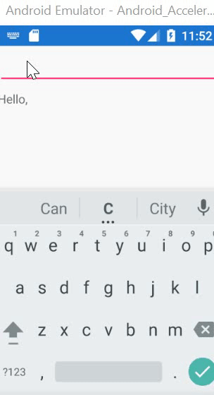
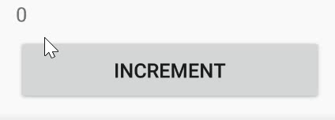
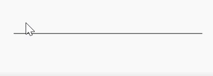

# **Clarity** is an application framework for XAML based platforms

## **How to install**

`install-package Clarity.XamarinForms`

(other platforms coming soon)

## **Main values**

* **Code should be readable.** As few boilerplate as possible. 
* **Code should be reusable.** Do not repeat yourself. Make sure to separate common patterns for later reuse.
* **Code should be local.** Easily switch between the UI and corresponding application logic.
* **Code should be live** Write code live, without restarting your application. (this requires LiveSharp extension)

## **Hello World example**

```cs
public class App : Application {
    public App() => MainPage = new Calculator().MainPage();
}

public class HelloWorld : ClarityPage
{
    public override View BuildContent()
    {
        var currentValue = CreateBindableValue("World");

        return StackLayout.Children(
                        Entry.Text(currentValue),
                        Label.Text(currentValue, v => "Hello, " + v)
               );
    }
}
```


As you can see, both **data** and **presentation** in the same method. But don't get your pitchforks up - **IT'S OKAY**. Your **data** still doesn't know anything about the **view** and most of the communication is still done with binding. Although now it's easier to navigate between the view and the code. 

## **Won't it become unreadable when I add more UI?**

Unlike with XAML, you can easily extract stuff away. Visual Studio has built-in refactorings for that.

```cs
    public override View BuildContent()
    {
        return StackLayout.Children(
                    Header("My application name"),
                    Label.Text("Content")
               );
    }

    public Grid Header(string applicationName) 
    {
        return Grid.Children(
                    Label.Text(applicationName)
               )
    }
```

Note that both methods can have separate data and logic. 

## **Commands and interaction**

You can pass labmda function to the `Command` extension method and it will be executed on click.

```cs
    public override View BuildContent()
    {
        var counter = CreateBindableValue(0);

        // define local function for Button's Command
        void increment() => counter.Value++;

        return StackLayout.Children(
                    Label.Text(counter),
                    Button.Text("Increment")
                            .Command(increment)
               );
    }
```

You can still use the good old `ICommand` interface if you want.



## **Validation**

Validation is done by `BindableValue<T>` and `BindableModel<T>`. 

```cs
    public override View BuildContent()
    {
        var summerMonth = CreateBindableValue("", validateSummerMonth);

        void validateSummerMonth(string month, Validator<string> validator) {
            if (month != "June" && month != "July" && month != "August")
                validator.AddError("Month can either be June, July or August");
        }

        return StackLayout.Children(
                    Entry.Text(summerMonth),
                    Label.Text(summerMonth.ValidationMessage)
               );
    }
```

